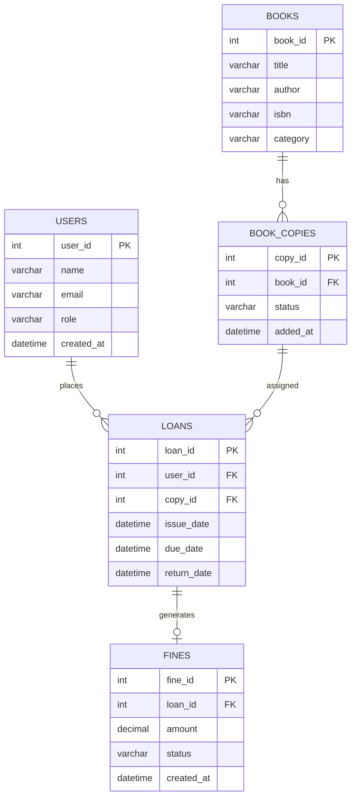

```mermaid
erDiagram

USERS {
    int user_id PK
    varchar name
    varchar email
    varchar role
    datetime created_at
}

BOOKS {
    int book_id PK
    varchar title
    varchar author
    varchar isbn
    varchar category
}

BOOK_COPIES {
    int copy_id PK
    int book_id FK
    varchar status
    datetime added_at
}

LOANS {
    int loan_id PK
    int user_id FK
    int copy_id FK
    datetime issue_date
    datetime due_date
    datetime return_date
}

FINES {
    int fine_id PK
    int loan_id FK
    decimal amount
    varchar status
    datetime created_at
}

USERS ||--o{ LOANS : places
BOOKS ||--o{ BOOK_COPIES : has
BOOK_COPIES ||--o{ LOANS : assigned
LOANS ||--o| FINES : generates
```
