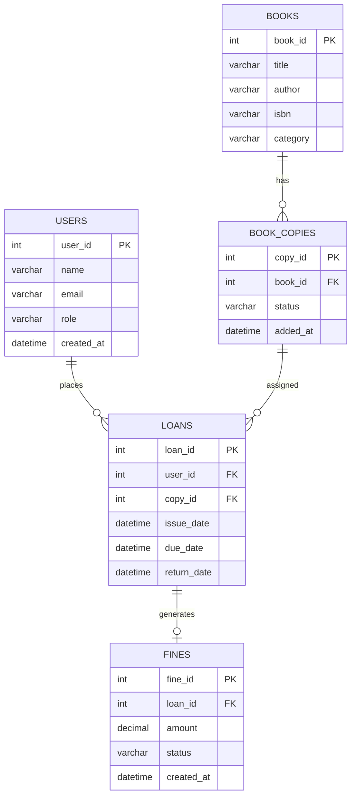
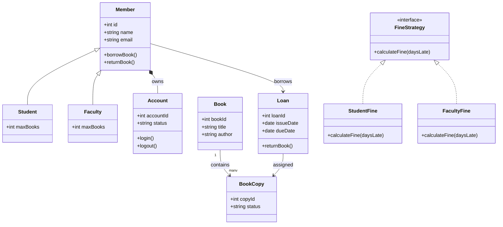
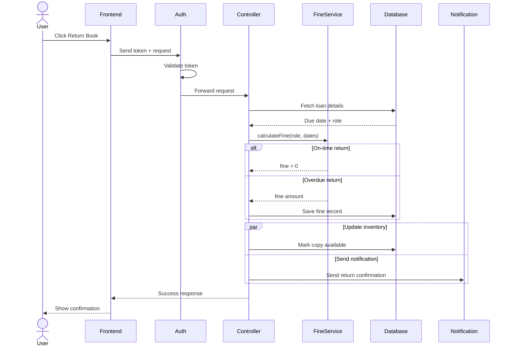
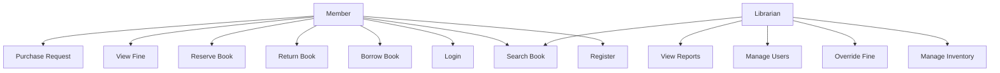

# 📚 BookNest — Smart Library Management System

> A full-stack, role-aware library management platform built with strict Object-Oriented Programming principles, dynamic fine calculation using the Strategy Pattern, and a layered MVC architecture backed by a relational MySQL database.

---

## Table of Contents

- [Project Overview](#project-overview)
- [Key Highlights](#key-highlights)
- [Tech Stack](#tech-stack)
- [System Architecture](#system-architecture)
- [Core Features](#core-features)
  - [Role-Based Membership System](#1-role-based-membership-system)
  - [Advanced Fine Calculation Engine](#2-advanced-fine-calculation-engine)
  - [Inventory and Reservation Management](#3-inventory-and-reservation-management)
  - [Authentication and Account Management](#4-authentication-and-account-management)
  - [Notification System](#5-notification-system)
  - [Admin Dashboard](#6-admin-dashboard)
- [OOP Design Patterns Used](#oop-design-patterns-used)
- [Database Schema (ER Diagram)](#database-schema-er-diagram)
- [Class Diagram](#class-diagram)
- [Sequence Diagram — Book Return Flow](#sequence-diagram--book-return-flow)
- [Use Case Diagram](#use-case-diagram)
- [Borrowing Rules Summary](#borrowing-rules-summary)
- [Fine Calculation Rules](#fine-calculation-rules)
- [Project Structure](#project-structure)
- [Getting Started](#getting-started)
  - [Prerequisites](#prerequisites)
  - [Installation](#installation)
  - [Environment Variables](#environment-variables)
  - [Running the App](#running-the-app)
- [API Overview](#api-overview)
- [Contributing](#contributing)
- [License](#license)

---

## Project Overview

BookNest is a production-grade, full-stack library management solution designed to handle the real-world complexity of a modern library system. It enforces different borrowing policies for different user types (Students vs. Faculty), applies dynamic fine calculations based on role and book type, prevents race conditions during concurrent reservations, and provides separate dashboards for members and librarians.

The system was built with a strong emphasis on the **backend logic**, rigorous adherence to **Object-Oriented Programming (OOP)** principles, and a clean **layered MVC architecture** that keeps business rules separate from data access and presentation layers.

---

## Key Highlights

- **Role-aware borrowing** — Students and Faculty operate under completely different borrowing limits and due date policies.
- **Dynamic fine engine** — Uses the Strategy Pattern to compute fines per user role and per book type, so adding a new fine rule never touches existing code.
- **Concurrency-safe reservations** — Prevents two users from simultaneously reserving the last available copy of a book.
- **Real-time inventory tracking** — Every book copy is individually tracked through the states: Available, Issued, Reserved, and Lost.
- **Clean OOP hierarchy** — A base `Member` class is extended by `Student` and `Faculty`, and a `FineStrategy` interface is implemented separately by `StudentFine` and `FacultyFine`.
- **Full-stack** — React.js frontend for both the Admin Dashboard and the Student/Faculty Portal, backed by a Node.js + Express.js REST API and a MySQL relational database.

---

## Tech Stack

| Layer | Technology |
|---|---|
| **Frontend** | React.js (Admin Dashboard + Member Portal) |
| **Backend** | Node.js with TypeScript / JavaScript |
| **API Framework** | Express.js |
| **Database** | MySQL (relational schema with foreign keys) |
| **Architecture** | Layered MVC + Repository Pattern |
| **Design Patterns** | Strategy, Inheritance, Repository, MVC |

---

## System Architecture

BookNest follows a strict **Layered MVC architecture** combined with the **Repository Pattern**:

```
┌─────────────────────────────────────────────┐
│                  React.js                   │  ← View Layer (Frontend)
│    (Admin Dashboard + Member Portal)        │
└───────────────────┬─────────────────────────┘
                    │ HTTP / REST
┌───────────────────▼─────────────────────────┐
│             Express.js Controllers          │  ← Controller Layer
│    (Route handlers, request validation)     │
└───────────────────┬─────────────────────────┘
                    │
┌───────────────────▼─────────────────────────┐
│              Service Layer                  │  ← Business Logic
│  (FineService, LoanService, BookService)    │
│  Implements Strategy Pattern for fines      │
└───────────────────┬─────────────────────────┘
                    │
┌───────────────────▼─────────────────────────┐
│            Repository Layer                 │  ← Data Access
│    (UserRepository, BookRepository, etc.)   │
└───────────────────┬─────────────────────────┘
                    │
┌───────────────────▼─────────────────────────┐
│               MySQL Database                │  ← Persistence Layer
│     (Relational schema with FK constraints) │
└─────────────────────────────────────────────┘
```

Each layer has a single, well-defined responsibility. The Controller layer never talks directly to the database — it always goes through the Service layer, which in turn uses the Repository layer for all data access.

---

## Core Features

### 1. Role-Based Membership System

BookNest uses an **inheritance-based membership model** where a base `Member` class is extended by `Student` and `Faculty`. Each role has its own borrowing limits, loan durations, and fine rates.

**Roles:**

| Role | Max Books | Loan Duration | Fine Rate (Standard) |
|---|---|---|---|
| Student | 3 books | 14 days | ₹10 / day |
| Faculty | 10 books | 90 days | ₹2 / day |

Both roles share common behaviour defined in the `Member` base class — including `borrowBook()` and `returnBook()` — but each subclass enforces its own limits.

### 2. Advanced Fine Calculation Engine

The fine calculation engine is the heart of BookNest's backend logic. It uses the **Strategy Pattern** via a `FineStrategy` interface to determine how fines are calculated based on user role and book type. This makes the system fully open for extension without modifying existing code.

**Fine Rules:**

| User Type | Book Type | Fine Rate |
|---|---|---|
| Student | Standard Book | ₹10 / day overdue |
| Faculty | Standard Book | ₹2 / day overdue |
| Any | Rare Book | ₹50 / day overdue |

The `FineService` selects the correct `FineStrategy` implementation (`StudentFine` or `FacultyFine`) at runtime based on the user's role and invokes `calculateFine(daysLate)`. The result is stored as a fine record linked to the loan.

### 3. Inventory and Reservation Management

Books in BookNest are separated into two levels:
- **Book** — the logical entity (title, author, ISBN, category).
- **BookCopy** — a physical copy of the book, each with its own individual lifecycle status.

Each copy is always in one of four states:

| Status | Description |
|---|---|
| `Available` | On the shelf, ready to be borrowed |
| `Issued` | Currently on loan to a member |
| `Reserved` | Held for a member who requested it |
| `Lost` | Reported as lost, pending resolution |

**Concurrency Handling:** The system prevents race conditions where two members attempt to reserve the last available copy simultaneously. Reservation requests are processed with locking logic to guarantee only one member succeeds.

### 4. Authentication and Account Management

Each member has an associated `Account` (composition relationship — an account cannot exist without a member). The account manages the member's login session with `login()` and `logout()` methods, and tracks the account status (e.g., active, suspended).

Token-based authentication protects all API endpoints. Every request to a protected route passes through the `Auth` middleware, which validates the token before forwarding the request to the controller.

### 5. Notification System

When a book is returned — whether on time or overdue — the system dispatches a return confirmation notification to the member. This runs in parallel with the inventory update step using a parallel execution pattern so neither step blocks the other.

Notifications can cover:
- Return confirmations
- Due date reminders
- Fine generated alerts
- Reservation availability alerts

### 6. Admin Dashboard

The Librarian (Admin) has access to a dedicated dashboard with capabilities beyond those of regular members:

- **Manage Inventory** — Add new books and book copies, update copy statuses, mark copies as lost.
- **Manage Users** — View all registered members, update roles, deactivate accounts.
- **Override Fines** — Manually waive or adjust a fine in exceptional cases.
- **View Reports** — Access usage statistics, overdue reports, and fine collection summaries.
- **Search Books** — Same search capability as regular members.

---

## OOP Design Patterns Used

### Inheritance (IS-A Relationship)

```
Member (base class)
├── Student (extends Member)
└── Faculty (extends Member)
```

`Member` defines the shared contract (`borrowBook()`, `returnBook()`) while `Student` and `Faculty` override the limits and durations specific to their role.

### Strategy Pattern (FineStrategy)

```
<<interface>> FineStrategy
├── StudentFine  implements FineStrategy
└── FacultyFine  implements FineStrategy
```

The `FineStrategy` interface defines `calculateFine(daysLate)`. At runtime, the `FineService` selects and injects the correct strategy based on the loan's user role. New fine rules (e.g., a premium member tier) can be added by creating a new class that implements `FineStrategy` — zero changes to existing code.

### Composition (HAS-A Relationship)

```
Member *── Account
```

A `Member` owns exactly one `Account`. The account lifecycle is tied to the member — it cannot exist independently.

### Repository Pattern

Each entity (User, Book, BookCopy, Loan, Fine) has its own dedicated Repository class that encapsulates all database queries for that entity. Controllers and Services never write raw SQL — they call Repository methods. This makes the data access layer swappable (e.g., switching from MySQL to PostgreSQL) without touching business logic.

---

## Database Schema (ER Diagram)

The relational schema is built around five core tables with foreign key constraints enforcing referential integrity.



**Relationships:**

- A `USER` can place zero or many `LOANS`.
- A `BOOK` has one or many `BOOK_COPIES` (each physical copy is tracked separately).
- A `BOOK_COPY` can be assigned to zero or many `LOANS` over its lifetime (one at a time).
- A `LOAN` generates at most one `FINE` (only when returned overdue).

---

## Class Diagram

The class diagram reflects the full OOP structure of the backend, including the inheritance hierarchy, the Strategy Pattern for fine calculation, and the composition between Member and Account.



---

## Sequence Diagram — Book Return Flow

This diagram shows the complete sequence of interactions when a member returns a book, including authentication, fine calculation, inventory update, and notification — all in the correct order with parallel execution where applicable.



**Key points in the flow:**
1. Every request is authenticated via the `Auth` middleware before reaching the Controller.
2. The Controller fetches the loan details (due date + user role) from the Database.
3. `FineService` is invoked with the role and dates — it selects the correct strategy and returns either `0` or a fine amount.
4. If a fine was generated, it is persisted in a separate fine record.
5. The inventory update (marking the copy Available) and the notification dispatch run **in parallel** to minimize response latency.
6. A success response is sent back through the Frontend to the User.

---

## Use Case Diagram

BookNest has two primary actors: the **Member** (Student or Faculty) and the **Librarian** (Admin).



**Member use cases:** Register, Login, Search Book, Borrow Book, Return Book, Reserve Book, View Fine, Submit Purchase Request.

**Librarian use cases:** Manage Inventory, Override Fine, Manage Users, View Reports, Search Book.

---

## Borrowing Rules Summary

| Rule | Student | Faculty |
|---|---|---|
| Maximum books at a time | 3 | 10 |
| Standard loan duration | 14 days | 90 days |
| Fine rate (standard book) | ₹10 / day | ₹2 / day |
| Fine rate (rare book) | ₹50 / day | ₹50 / day |
| Can reserve books | Yes | Yes |
| Can submit purchase requests | Yes | Yes |

---

## Fine Calculation Rules

Fines are calculated on the day of return based on the number of days the loan is overdue. There is no grace period by default.

```
fine = daysLate × ratePerDay

Where ratePerDay is determined by:
  - User is a Student  AND Book is standard → ₹10 / day
  - User is a Faculty  AND Book is standard → ₹2  / day
  - Book is Rare (any user type)            → ₹50 / day
```

The fine status can be one of: `Pending`, `Paid`, or `Waived` (by a Librarian override).

---

## Project Structure

```
BookNest---Smart-Library-Management-System/
│
├── ErDiagram.md            # Entity-Relationship diagram (Mermaid)
├── classDiagram.md         # Full OOP class diagram (Mermaid)
├── idea.md                 # Project concept and feature planning notes
├── sequenceDiagram.md      # Book return sequence diagram (Mermaid)
├── useCaseDiagram.md       # Actor use case diagram (Mermaid)
│
├── backend/                # Node.js + Express.js API (TypeScript)
│   ├── src/
│   │   ├── controllers/    # Route handlers (BookController, LoanController, etc.)
│   │   ├── services/       # Business logic (FineService, LoanService, BookService)
│   │   ├── repositories/   # Data access layer (UserRepository, BookRepository, etc.)
│   │   ├── models/         # OOP class definitions (Member, Student, Faculty, etc.)
│   │   ├── strategies/     # FineStrategy implementations (StudentFine, FacultyFine)
│   │   ├── middleware/      # Auth middleware, error handler
│   │   ├── routes/         # Express route definitions
│   │   └── app.ts          # Express app entry point
│   ├── package.json
│   └── tsconfig.json
│
├── frontend/               # React.js (Admin Dashboard + Member Portal)
│   ├── src/
│   │   ├── pages/          # Route-level pages (Dashboard, BookSearch, MyLoans, etc.)
│   │   ├── components/     # Reusable UI components
│   │   ├── services/       # API call wrappers
│   │   └── App.tsx         # Root component with routing
│   └── package.json
│
└── database/
    └── schema.sql          # MySQL DDL — table definitions with FK constraints
```

---

## Getting Started

### Prerequisites

Make sure the following are installed on your system before proceeding:

- **Node.js** v18 or higher
- **npm** v9 or higher (comes with Node.js)
- **MySQL** 8.0 or higher
- **Git**

### Installation

**1. Clone the repository**

```bash
git clone https://github.com/milanchahar/BookNest---Smart-Library-Management-System.git
cd BookNest---Smart-Library-Management-System
```

**2. Install backend dependencies**

```bash
cd backend
npm install
```

**3. Install frontend dependencies**

```bash
cd ../frontend
npm install
```

**4. Set up the database**

Log in to your MySQL instance and create the database:

```sql
CREATE DATABASE booknest;
```

Then import the schema:

```bash
mysql -u your_username -p booknest < database/schema.sql
```

### Environment Variables

Create a `.env` file inside the `backend/` directory with the following variables:

```env
# Server
PORT=5000
NODE_ENV=development

# Database
DB_HOST=localhost
DB_PORT=3306
DB_USER=your_mysql_username
DB_PASSWORD=your_mysql_password
DB_NAME=booknest

# JWT Authentication
JWT_SECRET=your_super_secret_jwt_key
JWT_EXPIRES_IN=7d
```

> **Important:** Never commit your `.env` file to version control. Add it to `.gitignore`.

### Running the App

**Start the backend server:**

```bash
cd backend
npm run dev
```

The API server will start at `http://localhost:5000`.

**Start the frontend development server:**

```bash
cd frontend
npm start
```

The React app will open at `http://localhost:3000`.

---

## API Overview

All API routes are prefixed with `/api/v1`. Protected routes require a valid JWT token in the `Authorization` header as `Bearer <token>`.

| Method | Endpoint | Auth Required | Description |
|---|---|---|---|
| `POST` | `/api/v1/auth/register` | No | Register a new member |
| `POST` | `/api/v1/auth/login` | No | Login and receive JWT token |
| `GET` | `/api/v1/books` | Yes | Search and list all books |
| `GET` | `/api/v1/books/:id` | Yes | Get a specific book and its copies |
| `POST` | `/api/v1/loans` | Yes | Borrow a book (issue a loan) |
| `PUT` | `/api/v1/loans/:id/return` | Yes | Return a borrowed book |
| `GET` | `/api/v1/loans/me` | Yes | Get all loans for the logged-in member |
| `POST` | `/api/v1/reservations` | Yes | Reserve a book copy |
| `GET` | `/api/v1/fines/me` | Yes | View fines for the logged-in member |
| `GET` | `/api/v1/admin/users` | Admin | Get all registered members |
| `PUT` | `/api/v1/admin/fines/:id/override` | Admin | Waive or adjust a fine |
| `POST` | `/api/v1/admin/books` | Admin | Add a new book to inventory |
| `POST` | `/api/v1/admin/copies` | Admin | Add a new copy of an existing book |
| `GET` | `/api/v1/admin/reports` | Admin | View usage and overdue reports |

---

## Contributing

Contributions are welcome. To contribute:

1. Fork this repository.
2. Create a new branch for your feature or bugfix:
   ```bash
   git checkout -b feature/your-feature-name
   ```
3. Make your changes, following the existing code style and architecture patterns.
4. Commit your changes with a clear, descriptive message:
   ```bash
   git commit -m "feat: add purchase request approval workflow"
   ```
5. Push your branch to your fork:
   ```bash
   git push origin feature/your-feature-name
   ```
6. Open a Pull Request against the `main` branch of this repository, describing what you changed and why.

Please make sure your code does not break any existing functionality before submitting a PR.

---

## License

This project is open-source and available under the [MIT License](LICENSE).

---

<div align="center">
  Built with care by <a href="https://github.com/milanchahar">Milan Chahar</a>
</div>
