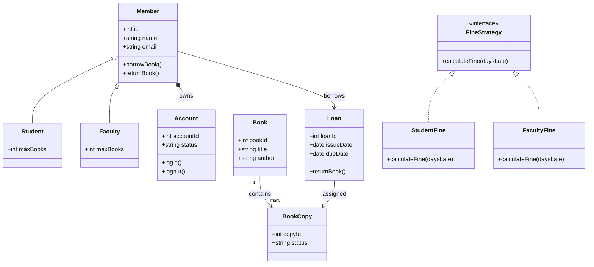

```mermaid
classDiagram

class Member{
  +int id
  +string name
  +string email
  +borrowBook()
  +returnBook()
}

class Student{
  +int maxBooks
}

class Faculty{
  +int maxBooks
}

Member <|-- Student
Member <|-- Faculty

class Account{
  +int accountId
  +string status
  +login()
  +logout()
}

Member *-- Account : owns

class Book{
  +int bookId
  +string title
  +string author
}

class BookCopy{
  +int copyId
  +string status
}

Book "1" --> "many" BookCopy : contains

class Loan{
  +int loanId
  +date issueDate
  +date dueDate
  +returnBook()
}

Member --> Loan : borrows
Loan --> BookCopy : assigned

class FineStrategy{
  <<interface>>
  +calculateFine(daysLate)
}

class StudentFine{
  +calculateFine(daysLate)
}

class FacultyFine{
  +calculateFine(daysLate)
}

FineStrategy <|.. StudentFine
FineStrategy <|.. FacultyFine
```
