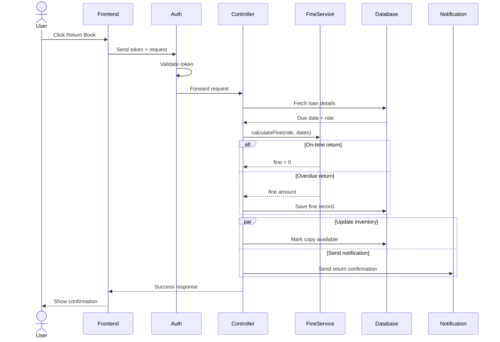

```mermaid
sequenceDiagram

actor User
participant Frontend
participant Auth
participant Controller
participant FineService
participant Database
participant Notification

User->>Frontend: Click Return Book
Frontend->>Auth: Send token + request
Auth->>Auth: Validate token
Auth->>Controller: Forward request

Controller->>Database: Fetch loan details
Database-->>Controller: Due date + role

Controller->>FineService: calculateFine(role, dates)

alt On-time return
    FineService-->>Controller: fine = 0
else Overdue return
    FineService-->>Controller: fine amount
    Controller->>Database: Save fine record
end

par Update inventory
    Controller->>Database: Mark copy available
and Send notification
    Controller->>Notification: Send return confirmation
end

Controller-->>Frontend: Success response
Frontend-->>User: Show confirmation
```
